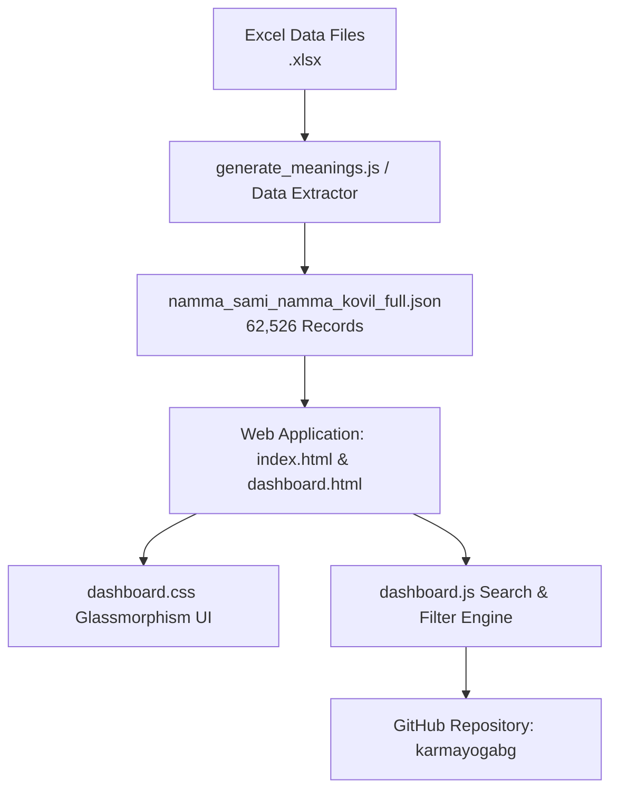

# `createNSNKWeb` Skill

This skill documents the end-to-end process for building, updating, and publishing the **Namma Sami Namma Kovil (NSNK) Web Application**, managing its underlying JSON datasets, and pushing changes to GitHub.

---

## 🏗️ Architecture & Component Overview



---

## 1. JSON Dataset Generation

To convert or extract `.xlsx` spreadsheets into clean, fast JSON datasets:

### Export Script (`node parse_xlsx_to_json.js`)
```javascript
const fs = require('fs');
const XLSX = require('xlsx');

const workbook = XLSX.readFile('நம்ம சாமி நம்ம கோவில் - full.xlsx');
const sheet = workbook.Sheets[workbook.SheetNames[0]];
const range = XLSX.utils.decode_range(sheet['!ref']);
const records = [];

for (let r = 1; r <= range.e.r; r++) {
  const getVal = (colIdx) => {
    const cell = sheet[XLSX.utils.encode_cell({ r: r, c: colIdx })];
    return cell ? String(cell.v).trim() : '';
  };
  const name = getVal(0);
  if (name && name !== '-') {
    records.push({
      name,
      mobile: getVal(1),
      region: getVal(2),
      district: getVal(3),
      union: getVal(4),
      pincode: getVal(5),
      meaning: getVal(6)
    });
  }
}

fs.writeFileSync('namma_sami_namma_kovil_full.json', JSON.stringify(records, null, 2));
```

---

## 2. Web Application Structure

The web application consists of 3 core files:

1. **[`index.html`](file:///home/sabrisatharamanathan/my-project/Aram-NSNK/index.html) / [`dashboard.html`](file:///home/sabrisatharamanathan/my-project/Aram-NSNK/dashboard.html)**:
   - Modern HTML5 layout with Lucide SVG icons and Google Fonts (`Outfit`, `Lora`, `Noto Sans Tamil`).
   - Hero metric counters (`62,526` Total Names, Unique Names, Total Districts, 100% Meaning Coverage).
   - Global Search input, Region & District selectors, Page size dropdown.
   - Quick Tamil letter chip filters (`அ`, `ஆ`, `இ`, `க`, `சா`, `தா`, `நா`, `பா`, `மா`, `ரா`, `வா`).
   - Glassmorphic name cards container & Detail Modal overlay with Copy Meaning button.

2. **[`dashboard.css`](file:///home/sabrisatharamanathan/my-project/Aram-NSNK/dashboard.css)**:
   - HSL dark theme variables (`--bg-dark: #070913`, `--accent-primary: #8b5cf6`, `--accent-secondary: #06b6d4`, `--accent-gold: #f59e0b`).
   - Glassmorphism backdrop filter support, CSS Grid responsive rules, micro-animations.

3. **[`dashboard.js`](file:///home/sabrisatharamanathan/my-project/Aram-NSNK/dashboard.js)**:
   - Async dataset fetcher for `namma_sami_namma_kovil_full.json`.
   - Debounced (150ms) multi-field string matching engine (Name, Phone, District, Union, Meaning).
   - Tamil letter prefix filtering logic.
   - Pagination engine and clipboard copy utility (`navigator.clipboard.writeText`).

---

## 3. Security & Secret Scanning Compliance

Before committing to GitHub:
- **Never include hardcoded API keys** inside `.js` files.
- Always use environment variables (`process.env.GEMINI_API_KEY`) or CLI parameters (`--key`).

---

## 4. Git & GitHub Publishing Workflow

To push the web dashboard and dataset to GitHub under `karmayogabg`:

```bash
# 1. Initialize Git & User Details
git init
git config user.name "karmayogabg"
git config user.email "karmayogabg@gmail.com"

# 2. Add Remote for namma-sami-namma-kovil repository
git remote add origin git@github.com:karmayogabg/namma-sami-namma-kovil.git

# 3. Commit Codebase
git add index.html dashboard.html dashboard.css dashboard.js namma_sami_namma_kovil_full.json README.md .gitignore .agents/
git commit -m "Add Namma Sami Namma Kovil Web Dashboard & 62k Tamil Name Meanings Dataset"

# 4. Push to Main Branch
git push -u origin main
```

---

## 5. Local Testing & Verification

To verify the app locally:
```bash
npx serve .
```
Open `http://localhost:3000` to test search, Tamil letter quick filters, and detail modal copy functionality.
