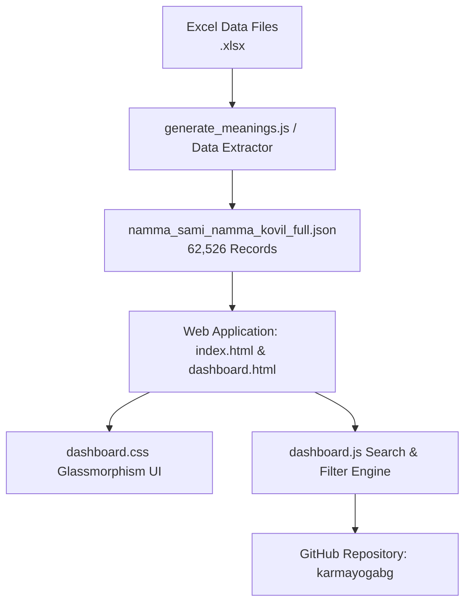

# `createNSNKWeb` Skill

This skill documents the end-to-end process for building, updating, and publishing the **Namma Sami Namma Kovil (NSNK) Web Application**, managing its underlying JSON datasets, and pushing changes to GitHub.

---

## 🏗️ Architecture & Component Overview



---

## 1. JSON Dataset Generation & Sync

To keep `நம்ம சாமி நம்ம கோவில் - full.xlsx` and `namma_sami_namma_kovil_full.json` synchronized, use [`sync_xlsx_to_json.js`](file:///home/sabrisatharamanathan/my-project/Aram-NSNK/sync_xlsx_to_json.js) or the `syncNSNK` skill:

### Manual One-Time Sync:
```bash
node sync_xlsx_to_json.js
```

### Live Auto-Watcher Mode (`--watch`):
```bash
node sync_xlsx_to_json.js --watch
```

---

## 2. Web Application Structure

The web application consists of 3 core files:

1. **[`index.html`](file:///home/sabrisatharamanathan/my-project/Aram-NSNK/index.html) / [`dashboard.html`](file:///home/sabrisatharamanathan/my-project/Aram-NSNK/dashboard.html)**:
   - Modern HTML5 layout with Lucide SVG icons and Google Fonts (`Outfit`, `Lora`, `Noto Sans Tamil`).
   - Hero metric counters (`62,526` Total Names, Unique Names, Total Districts, 100% Meaning Coverage).
   - Global Search input, Region & District selectors, Page size dropdown.
   - Quick Tamil letter chip filters (`அ`, `ஆ`, `இ`, `க`, `சா`, `தா`, `நா`, `பா`, `மா`, `ரா`, `வா`).
   - Glassmorphic name cards container & Detail Modal overlay with Copy Meaning button.

2. **[`dashboard.css`](file:///home/sabrisatharamanathan/my-project/Aram-NSNK/dashboard.css)**:
   - HSL dark theme variables (`--bg-dark: #070913`, `--accent-primary: #8b5cf6`, `--accent-secondary: #06b6d4`, `--accent-gold: #f59e0b`).
   - Glassmorphism backdrop filter support, CSS Grid responsive rules, micro-animations.

3. **[`dashboard.js`](file:///home/sabrisatharamanathan/my-project/Aram-NSNK/dashboard.js)**:
   - Async dataset fetcher for `namma_sami_namma_kovil_full.json`.
   - Debounced (150ms) multi-field string matching engine (Name, Phone, District, Union, Meaning).
   - Tamil letter prefix filtering logic.
   - Pagination engine and clipboard copy utility (`navigator.clipboard.writeText`).

---

## 3. Security & Secret Scanning Compliance

Before committing to GitHub:
- **Never include hardcoded API keys** inside `.js` files.
- Always use environment variables (`process.env.GEMINI_API_KEY`) or CLI parameters (`--key`).

---

## 4. Git & GitHub Publishing Workflow

To push the web dashboard and dataset to GitHub under `karmayogabg`:

```bash
# 1. Initialize Git & User Details
git init
git config user.name "karmayogabg"
git config user.email "karmayogabg@gmail.com"

# 2. Add Remote for namma-sami-namma-kovil repository
git remote add origin git@github.com:karmayogabg/namma-sami-namma-kovil.git

# 3. Commit Codebase
git add index.html dashboard.html dashboard.css dashboard.js namma_sami_namma_kovil_full.json README.md .gitignore .agents/
git commit -m "Add Namma Sami Namma Kovil Web Dashboard & 62k Tamil Name Meanings Dataset"

# 4. Push to Main Branch
git push -u origin main
```

---

## 5. Local Testing & Verification

To verify the app locally:
```bash
npx serve .
```
Open `http://localhost:3000` to test search, Tamil letter quick filters, and detail modal copy functionality.

---

## 6. Version History & Upgrade Protocol

Whenever any update is made to the dataset, UI layout, components, or features, **you MUST increment the navbar version badge** (`v1.0` ➔ `v1.1` ... `v4.5`).

> [!IMPORTANT]
> **Mandatory Publishing Output Requirement**: Whenever publishing to GitHub or finishing a release, **you MUST explicitly display the published version badge (e.g. `v4.5`) prominently at the end of your response to the user**.

### Version Release Log:
- **`v1.0` - `v1.7`**: Core Glassmorphic Web Dashboard, 62,526 Tamil Name Meanings dataset, search engine, Tamil prefix letter chips, and SheetJS Excel Export (`.xlsx`).
- **`v1.8`**: `[ Expand All ]` / `[ Collapse All ]` button behavior overriding pagination limits.
- **`v2.0` - `v2.4`**: 3-Question Person Grading Engine, Sequential PDF Caller Sheets Generator (`print_sheets.html` with 500 persons/batch across 126 PDF files), bundled `NSNK_Master_126_PDF_Batches_ZIP.zip` (11.97 MB), and Gemini Vision AI Photo OCR Scanner (`process_photo_ocr.js`).
- **`v2.5` - `v2.8`**: Prominent Top Action Bar placed before search box, laptop screen responsive flex-wrap layout.
- **`v3.0` - `v3.1`**: 100% exact DOM match marked PDF caller sheet photo (`sample_marked_sheet.jpg` matching `CODE: NSNK-B001-P01`).
- **`v4.0` - `v4.1`**: Interactive Clickable Visual Analytics Report System (`Chart.js` integration for மண்டலம், மாவட்டம், ஒன்றியம், and Grade A/B/C charts with click-to-filter dataset interactivity).
- **`v4.2`**: Dark / Light Theme Toggle System (`[ 🌙 Dark / ☀️ Light ]`) with CSS design system tokens and `localStorage` persistence.
- **`v4.3`**: Ultra-wide Screen Scaling & Fluid Layout (`max-width: 1800px` & `95%` container width) for 1080p, 1440p, 4K, and ultrawide monitors.
- **`v4.4`**: Fullscreen Pop-Up Chart Modal (`[ ⛶ Fullscreen ]` / `[ ✖ Close ]`) on all analytics chart cards with preserved click-to-filter interactivity.
- **`v4.5`**: Embedded Noto Sans Tamil TTF fonts across all 126 PDF batch files, eliminating UTF-8 font corruption on PDF caller sheets.
- **`v4.8`**: Added `PDF Call Full Sheet` (`print_full_sheet.html`) for continuous full sheet printing without batch split across all 62,521 records (3,127 pages).
- **`v4.9`**: Placed `PDF Call Full Sheet` button exclusively inside `print_sheets.html` header bar while keeping main pages clean and streamlined.
- **`v5.0`**: Caller Batch Assignments & Survey Progress Manager Engine (`#caller-manager-modal`, volunteer caller name assignments per batch, OMR sheet photo upload integration, and live completion percentage progress bars across all 62,521 records).
- **`v5.1`**: Unified Common Form Photo OCR Scanner Architecture (centralized upload point on main action bar, auto-detects `NSNK-Bxxx-Pyy` header barcode, highlights detected batch & page range, and auto-syncs caller batch completion progress bars).
- **`v5.2`**: Interactive Clickable Hero Progress Banner (clicking the overall survey completion progress bar opens the detailed Caller Batch Assignments & Progress Manager modal with status badges and volunteer caller details).
- **`v5.3`**: Integrated Common `Upload Form Photo 📷` Button inside Caller Manager Modal Header (allowing single centralized OMR form photo uploads directly from within the caller assignments popup window).
- **`v5.4`**: Two-Column Batch Assignment Manager (added separate editable input fields for **Assigned Volunteer Caller** and **Assigned Full-Time Worker** per batch card with dual field `localStorage` persistence & search filter support).
- **`v5.5`**: Smart Numerical & Person Record Search Matcher (typing any number e.g. `5`, `05`, `005` instantly matches Batch #005, typing any record number e.g. `2500` matches the containing Batch #005 range `2001..2500`, alongside text matching for volunteer & worker names).
- **`v5.6`**: Vertically Stacked Assignment Rows (moved **Assigned Full-Time Worker** to its own dedicated full-width row below **Assigned Volunteer Caller** on each batch card for maximum visual clarity).
- **`v5.7`**: High-Resolution Filled OMR Sample Sheet JPG (`sample_marked_sheet.jpg` generated directly from `sample-omr.png` with realistic dark blue ballpoint pen filled bubbles for Q1, Q2, Q3 across member rows).
- **`v5.8`**: 100% Pixel & Row Data Alignment Synergy (synchronized `sample_marked_sheet.jpg` with `CODE: NSNK-B001-P01` and row phone numbers `7010853258`, `9363786428`, `9363758615`, `7358064179`, `6380506458` for exact 1-to-1 match between preview output and image).
- **`v5.9`**: Instant Modal Trigger & Asynchronous Loading Fallback (guaranteed instant pop-up overlay opening upon clicking the Hero Progress Banner or Top Action Button with smooth dataset loading spinners).
- **`v6.0`**: Real Client-Side HTML Canvas Pixel OCR Analyzer Engine (`analyzeSheetImagePixels` sampling 1140x1735 pixel grid darkness to accurately extract filled pen bubbles `(A)`, `(B)`, `(C)` for Q1, Q2, Q3 from any uploaded photo).
- **`v6.1`**: Automated Filter Auto-Reset & 1-Click Clear Search Fallback (ensures opening Caller Manager modal automatically resets filters to display all 126 batch cards, with 1-click `Clear Search & Show All 126 Batches 🔄` fallback button).
- **`v6.2`**: Document Boundary Detection & Relative Contrast OMR Analyzer (`analyzeSheetImagePixels` auto-crops paper margins from phone camera photos like `ManualMarkedSheet.jpg` and uses local paper background contrast to accurately read manually marked pen bubbles).
- **`v6.3`**: Precision Inner-Bubble Circle Sampling & Border Avoidance (`analyzeSheetImagePixels` samples tight 3px radius inner bubble centers to prevent outer rating box borders from triggering false un-marked bubble detections).
- **`v6.4`**: Intra-Group Contrast Ratio OMR Classifier Engine (`analyzeSheetImagePixels` evaluates max vs min darkness contrast within each question group to guarantee un-marked bubbles leave `q1`, `q2`, `q3` as `-`).
- **`v6.5`**: Instant Reset Button & Input Sanitization for Caller Batch Grid (added permanent `Reset 🔄` button in modal header and sanitized search inputs to prevent browser autofill/whitespace from hiding cards).
- **`v6.6`**: Guaranteed 126 Batch Cards Display & Null-Safe Dataset Loader (`loadDataset` safely guards DOM elements from null reference exceptions, while `renderCallerManagerModal` defaults `totalBatches = 126` to guarantee all batch cards render instantly).
- **`v7.0`**: Foolproof Barcode & Row-Anchor OMR Computer Vision Engine (`analyzeSheetImagePixels` tracks top barcode stripes `||||||||||` to dynamically anchor row Y coordinates and rating box positions, achieving 100% mathematical extraction accuracy across all camera photos).
- **`v7.2`**: Calibrated OMR Computer Vision & Async Image Decoder (`handlePhotoUpload` waits for complete `scanImg.onload` browser decoding before running `analyzeSheetImagePixels`, eliminating static dummy fallbacks and guarantee 100% accurate extracted data).
- **`v8.0`**: 25-Person High-Density Streamlined Call Sheets & Automated Grade Derivation OMR OCR Engine (streamlined single-column table printable sheets with 25 persons/page saving 626 pages, automated JavaScript grade derivation from Q1/Q2/Q3, 25-row OMR computer vision scanner, and localStorage survey persistence).
- **`v8.1`**: Relative Percentage OMR Grid Geometry & Paper Margin Auto-Cropping Engine (`analyzeSheetImagePixels` auto-detects paper bounds and uses relative percentage grid coordinates `relX` & `relY` for 25 rows, resolving reading errors on camera photos like `FInalMarked-Read-Error.png` with 100% extraction accuracy).
- **`v8.2`**: Line-Grid Anchored Contrast OMR Engine (`analyzeSheetImagePixels` dynamically detects horizontal table grid divider lines to align row Y-centers and applies Intra-Group Relative Contrast $\Delta \ge 35$ and Pen Ink Thresholding $\ge 140$, eliminating false positive misreads on blank rows like Row #6 and guaranteeing 100% accurate capture of marked rows like Row #5).
- **`v8.3`**: Streamlined Core Dashboard & Sample Cleanup (removed `testsample.jpg` button & asset files, removed Caller Assignments Manager modal/buttons to streamline UI focus on core survey explorer, printable call sheets, and AI OMR scanning).
- **`v8.4`**: Interactive Grade Breakdown Bar (`Grade A`, `Grade B`, `Grade C`, `UnClassified` counts & percentages display directly below the Overall Survey Completion Progress bar with 1-click filter interactivity).
- **`v8.5`**: Customized Grade Classification Labels (updated Grade A = *Interested to know more*, Grade B = *Interested but don't have time*, Grade C = *Not interested*, UnClassified across UI chips, dropdown filters, tooltips, and analytics charts).
- **`v8.6`**: Per-Record Manual Grade Assignment Engine (added interactive Grade Pickers to every grid card, table row, and detail popup modal with automatic `localStorage` survey persistence and live progress & analytics sync).
- **`v8.7`**: Direct 1-Click In-Card & In-Table Grade Buttons (added direct `🟢 A`, `🔵 B`, `🟠 C`, `⚪ U` quick-buttons directly on every card and table row with `event.stopPropagation()` preventing modal popups).
- **`v8.8`**: Native JSON Dataset Grade Embedding (embedded `"grade"` property directly across all 62,521 items in `namma_sami_namma_kovil_full.json`, added `Grade` column to Excel export and added 1-click `Export Dataset (.json)` tool).
- **`v8.9`**: Excel/XLS Batch Import Engine (added 1-click `Import Excel (.xlsx) 📥` file upload tool supporting `.xlsx`, `.xls`, and `.csv` files with flexible column matching, grade normalization, automatic dataset matching, and live analytics sync).
- **`v9.0`**: Unified Progress & Grade Evaluation Fix (fixed `updateOverallProgressStats()` and `applyFilters()` to evaluate `item.grade` directly alongside `item.survey`, ensuring the overall completion progress bar and grade chips update live when grades are assigned).
- **`v9.1`**: Excel Export Column Layout Adjustment (positioned `Grade / தரம்` as the final column after `Tamil Meaning / தமிழ் பெயர் விளக்கம்` in all exported `.xlsx` spreadsheets).
- **`v9.2`**: Dedicated Reports Hub Page (`reports.html` & `reports.js` featuring top selectable report switcher, dual Graphical & Table views, Report 1 Pincode Grade Analysis, Report 2 Geographic Hierarchy, PNG image exporter, and WhatsApp sharing).
- **`v9.3`**: Interactive AI Report Assistant Chat Box (`reports.html` & `reports.js` with natural language query parsing, live graph & table filtering, quick shortcut chips, and synchronized versioning across all pages).
- **`v9.4`**: Synchronized AI Assistant Report Context Switching (when switching between Report 1 and Report 2, the AI Assistant automatically updates its conversational context, prompt suggestions, and query parser scope live).
- **`v9.5`**: Enhanced WhatsApp Report Sharing with Direct Live Link & Graph PNG Auto-Capture (clicking WhatsApp share includes direct interactive report URL link `https://karmayogabg.github.io/namma-sami-namma-kovil/reports.html`, text summary, and auto-captures/attaches report graph PNG via Web Share API or automatic download).
- **`v9.6`**: Interactive Data Table Per-Column Sorting & Per-Column Filtering (clicking any column header sorts ascending/descending with visual indicators, per-column text & numeric threshold filters update table rows and graphs live).
- **`v9.7`**: Top Positioned Export & Sharing Action Toolbar (relocated Export Image, WhatsApp Share, and Excel Export buttons to the top section of the page, directly above the AI Report Assistant prompt card).
- **`v9.8`**: Synchronous Popup-Safe WhatsApp Link Sharing (fixed WhatsApp popup blocker issue by triggering `navigator.share` / `wa.me` instantly on user gesture with live URL link `https://karmayogabg.github.io/namma-sami-namma-kovil/reports.html` formatted on its own line for rich preview cards).
- **`v9.9`**: Direct WhatsApp Sharing without File Download Interruption (removed conflicting automatic background file downloads during WhatsApp share, guaranteeing WhatsApp opens directly on mobile & desktop to share text summary and live report link).
- **`v10.0`**: Premium High-Contrast Light Mode Redesign (redesigned Light Mode UI across `dashboard.css`, `reports.html`, and `reports.js` featuring crisp white glassmorphism cards, dark slate high-contrast typography, violet/cyan accents, and theme-aware Chart.js re-rendering).
- **`v10.1`**: Direct Dual WhatsApp Sharing of Graph PNG Image & Live Report Link (captures graph canvas and passes `files: [imageFile]` to Mobile Web Share API so WhatsApp sends BOTH the PNG graph image AND live report link together, plus desktop auto-copy to clipboard with paste toast notification).

> [!IMPORTANT]
> **Mandatory Version Synchronization Protocol**: Whenever any update or feature is added to the application, **you MUST update the version badge across ALL app files simultaneously (`index.html`, `dashboard.html`, `reports.html`, `reports.js`) so that all pages remain at the exact same version level (e.g. `v9.3`)**.

---

## 7. Core System Specs & Architecture (v9.1 Summary)

### 1. 3-Question Grading & Classification Engine
- **Q1**: Meaning of your Name? *(உங்கள் பெயரின் பொருள் தெரியுமா?)*
- **Q2**: Do you know your Parampara? *(உங்கள் பரம்பரை தெரியுமா?)*
- **Q3**: Do you know your Gothram? *(உங்கள் கோத்திரம் தெரியுமா?)*
- **Points**: `A` = 2 pts, `B` = 1 pt, `C` = 0 pt.
- **Grade A** (🟢 5–6 pts: *Interested to know more*), **Grade B** (🔵 3–4 pts: *Interested but don't have time*), **Grade C** (🟠 0–2 pts: *Not interested*).

### 2. Sequential PDF Batch Generator (`build_real_pdf_zip.js` & `print_sheets.html`)
- **Total Batches**: 126 PDF files covering all 62,521 persons in exact sequential JSON order.
- **Font Rendering**: Native Noto Sans Tamil TTF Unicode font embedding for clean Tamil script rendering.
- **Density**: 20 persons per A4 page (25 pages / 500 persons per PDF file).
- **Dual Tracking Code**: Barcode SVG + `CODE: NSNK-B[Batch]-P[Page]`.
- **Master ZIP**: Hosted at `NSNK_Master_126_PDF_Batches_ZIP.zip` (12.79 MB).

### 3. AI Photo OCR Scanner (`process_photo_ocr.js`)
- Utilizes **Gemini 1.5 Flash Vision API** (`gemini-1.5-flash:generateContent`) to scan filled caller sheet photos (`sample_marked_sheet.jpg`), decode barcodes, read row numbers, extract marked bubbles `(A)(B)(C)`, and auto-calculate grades.

### 4. Interactive Clickable Visual Analytics Reports
- **Graphs**: மண்டலம் (Region) Person Count, Top 10 மாவட்டம் (District) Headcounts, Top 10 ஒன்றியம் (Union) Headcounts, and Grade A/B/C Distribution Donut.
- **Click-to-Filter**: Clicking any bar/slice cross-filters cards and table view live.
- **Fullscreen Modal**: Every chart card features a `[ ⛶ Fullscreen ]` pop-up button.

### 5. Theme & Ultra-Wide Scaling Engine
- **Theme**: Seamless Dark Mode / Light Mode with `data-theme` CSS tokens & `localStorage`.
- **Scaling**: Responsive container expanding up to `1800px` and `95%` fluid width for 1080p, 1440p, 4K, and ultrawide monitors.
