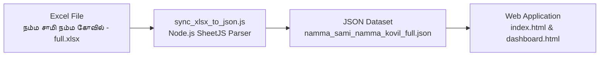

# `sync-nsnk-data` Skill

This skill documents how to keep **`நம்ம சாமி நம்ம கோவில் - full.xlsx`** and **`namma_sami_namma_kovil_full.json`** in complete 1-to-1 sync.

---

## 🏗️ Architecture & Sync Flow



---

## ⚡ Execution Commands

### 1. Manual Sync Trigger (One-Time Execution)
To manually parse the Excel file and update the JSON dataset immediately:
```bash
node sync_xlsx_to_json.js
```

### 2. Automated Live Watcher Mode (`--watch` / `-w`)
To monitor the `.xlsx` file for changes in real-time. Whenever the Excel file is modified or saved, `sync_xlsx_to_json.js` will automatically detect the file update and re-sync the JSON dataset:
```bash
node sync_xlsx_to_json.js --watch
```

### 3. Custom Input & Output Paths
To specify custom file paths:
```bash
node sync_xlsx_to_json.js --file "./path/to/file.xlsx" --output "./path/to/output.json"
```

---

## 📊 Dataset Column Schema

The sync script maps columns from the active sheet in `நம்ம சாமி நம்ம கோவில் - full.xlsx` as follows:

| Column | Excel Field Name | JSON Field Key | Type | Description |
| :--- | :--- | :--- | :--- | :--- |
| **A** | `பெயர்` | `name` | String | Person's name |
| **B** | `தொடர்பு எண்` | `mobile` | String | Mobile phone number |
| **C** | `மண்டலம்` | `region` | String | Region name |
| **D** | `மாவட்டம்` | `district` | String | District name |
| **E** | `ஒன்றியம்` | `union` | String | Union name |
| **F** | `பின்கோடு` | `pincode` | String | Postal pincode |
| **G** | `தமிழ் பெயர் விளக்கம்` | `meaning` | String | Tamil name meaning |
| **H** | `தரம்` | `grade` | String | Grade classification (`Grade A`, `Grade B`, `Grade C`, `Ungraded`) |

---

## 🔒 Grade Preservation Strategy
- If Grade exists in Column H of the Excel sheet, it is assigned directly.
- If Column H is absent or blank in Excel, the sync engine checks `namma_sami_namma_kovil_full.json` for any previously assigned manual grade (`Grade A`, `Grade B`, `Grade C`) matching `name + mobile` and preserves it.
- If no previous grade exists, it defaults to `'Ungraded'`.
